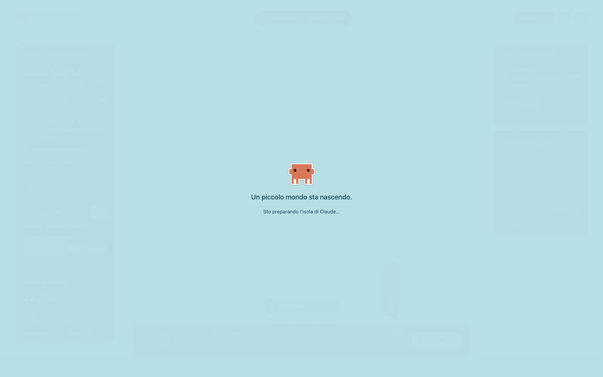

# Claude Island 🏝️

Un mondo 3D dove Clawd vive, programma, cresce e costruisce la sua isola. Gioca dal browser o con l’APK Android, anche senza Internet. Nessun account o chiave API.

**[Scarica l’APK e il gioco per PC](https://github.com/Dvlce/claude-island/releases/latest)**



## Android

Scarica `Claude-Island-1.0.0.apk` dalla release, aprilo e consenti l’installazione da quella sorgente quando Android lo richiede. È un APK release firmato: tutti gli asset sono inclusi. Richiede Android 8+ e Android System WebView recente con WebGL 2. Il gioco non richiede il permesso Internet.

## Giocare in locale su PC, Mac e Linux

Scarica ed estrai `Claude-Island-PC-1.0.0.zip`, oppure clona la repo. Serve Python 3 e un browser con WebGL 2.

```sh
python3 play.py
```

Il browser si apre su `http://127.0.0.1:5179`. Su Windows puoi fare doppio clic su `Gioca.bat`; su macOS su `Gioca.command`.

```sh
# Altra porta, oppure senza aprire automaticamente il browser
python3 play.py --port 5180 --no-browser
```

Non aprire direttamente `index.html` con `file://`: i moduli JavaScript richiedono il server locale. Non servono npm, librerie da installare o Internet per giocare.

## Una vita sull’isola

- Claude sceglie attività secondo energia, curiosità, voglia di giocare, meteo e orario. Programma, visita negozi e libreria, beve un caffè e riposa.
- **Skate:** tavola, ollie e rotazione della tavola. **Mago:** cappello, bacchetta e stelline. **Nerd:** occhialoni, portatile e mani che digitano. **Nuoto:** maschera, bracciate, scia e ritorno alla spiaggia.
- Nel pannello Claude scegli un’attività e premi **Vai** per invitarlo a provarla. Può sceglierla anche da solo.
- **Espandi · 80:** Claude indossa casco e martello e aggiunge terra. Fino a 10 ampliamenti, oltre alla crescita per livello.
- **Edificio · 60:** apre un cantiere e costruisce uno degli 8 nuovi edifici, con impalcatura e avanzamento visibile. Serve abbastanza terreno. I materiali si rigenerano durante la simulazione; Claude può avviare lavori autonomamente. Interrompere un lavoro rimborsa il costo; un cantiere interrotto dalla chiusura della pagina viene rimborsato al rientro.
- 27 livelli, dalle origini a Fable 5.1, e 32 voci nell’archivio storico. La crescita sblocca case, sentieri e fino a 12 abitanti delle generazioni precedenti. Opus/Sonnet 5.5 rimangono nell’archivio e si sbloccano alla maestria; Mythos resta una voce storica con accesso ristretto.

## Comandi

| Azione | Comando |
| --- | --- |
| Ruota la camera | Trascina con mouse o dito |
| Zoom | Rotellina, pinch oppure + / − |
| Sposta la camera | Tasto destro o due dita |
| Muovi Claude | «Guida Claude», poi WASD/frecce o controllo touch |
| Salta | J durante il controllo manuale |
| Torna alla vita autonoma | Esc o «Torna alla vita automatica» |
| Visita un edificio | Clic/tap sull’edificio |
| Accelera la vita | 1×, 5×, 20× |
| Commissiona un lavoro | Pannello Claude → Espandi / Edificio |

Sul telefono apri il pannello con **Claude** nella barra inferiore. **Auto / Fluido / Dettagliato** in alto controlla la qualità grafica.

## Prestazioni

Gli elementi statici sono accorpati in geometrie con colori per vertice; le mascotte condividono un’unica istanza GPU per le parti cubiche. Le ombre vengono ricalcolate per crescita e costruzioni. Acqua, vegetazione e onde usano geometrie più leggere. Auto riduce la risoluzione sui dispositivi lenti; Fluido disabilita ombre e sfocature. Il rendering si ferma in background.

Nel test Chromium con WebGL software, il villaggio maturo passa da **730 a 61 chiamate di disegno** e da **101.843 a 39.093 triangoli** prima di nuove costruzioni. Sono misure del carico della scena, non una garanzia di framerate su ogni dispositivo. La simulazione segue il tempo trascorso indipendentemente dal rendering.

## Progressi e offline

Progressi, edifici e ampliamenti vengono salvati nel dispositivo (`claude-island-v1` in localStorage). La simulazione recupera fino a 8 ore fuori pagina; una partita salvata in pausa non cresce. Dal menu di aiuto puoi esportare e importare una copia JSON, anche tra APK e browser. Importare sostituisce la partita corrente. Disinstallare o cancellare i dati rimuove il salvataggio locale.

Meteo, token, attività e codice sono simulati. Non si collega all’account Claude e non usa l’API Anthropic. Solo i link agli annunci storici aprono un sito esterno.

## Compilare l’APK

JDK 17, Android SDK 35, build-tools 35.0.0. Gradle 8.11.1 incluso tramite wrapper e checksum verificabile; Android Gradle Plugin fissato a 8.9.2. La prima build richiede Internet per scaricare le dipendenze.

```sh
cd android
# Configura ANDROID_HOME oppure local.properties con sdk.dir=...
./gradlew :app:assembleDebug
# Windows: gradlew.bat :app:assembleDebug
```

APK: `android/app/build/outputs/apk/debug/app-debug.apk`. GitHub Actions compila automaticamente un APK debug scaricabile dagli artifact. Debug e release hanno firme diverse: per passare dall’uno all’altra, esporta i progressi e disinstalla la versione precedente.

Per firmare una tua release, crea una chiave con `keytool` e un file **locale, ignorato da Git** `android/keystore.properties`:

```properties
storeFile=la-tua-chiave.jks
storePassword=LA_TUA_PASSWORD
keyAlias=IL_TUO_ALIAS
keyPassword=LA_TUA_PASSWORD
```

Poi `./gradlew :app:assembleRelease`. Senza quel file, il target release produce un APK non firmato. Le chiavi di firma non sono pubblicate.

## Verifica

```sh
python3 -m pip install playwright
python3 -m playwright install chromium
python3 play.py --no-browser
# In un altro terminale:
python3 check_browser.py
```

Il controllo verifica movimento, meteo, pausa, crescita, archivio, qualità grafica, quattro attività, nuoto, costruzioni, ampliamenti, salvataggi, budget di disegno e assenza di richieste esterne. La build Android esegue i controlli lint della release. I checksum dei download sono allegati alla release.

## Crediti

- [Three.js r180](https://github.com/mrdoob/three.js), MIT; moduli e licenza in `dist/vendor/`.
- [Clawd / Claude Code](https://www.stickermule.com/claudecode/item/19156131), riferimento per la mascotte. Marchi e immagine di riferimento appartengono ai rispettivi titolari.
- Storia dei modelli: annunci ufficiali Anthropic collegati in ogni scheda; archivio verificato al 3 ottobre 2026.
- Villaggio, geometrie, animazioni e meccaniche originali. Font di sistema; tutti gli asset del gioco inclusi nella distribuzione.

Progetto fan indipendente, non affiliato ad Anthropic. Codice originale MIT; le risorse di terzi mantengono i propri diritti e licenze.
